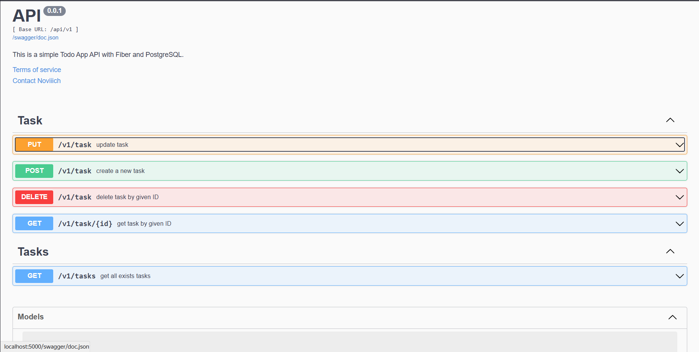
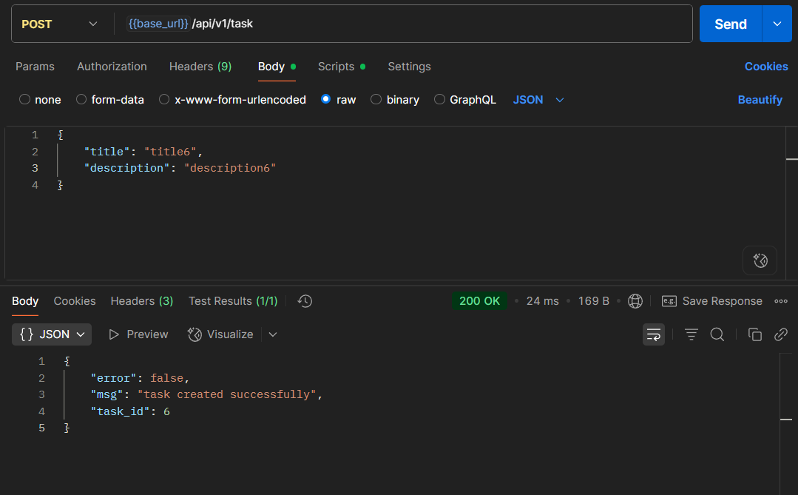
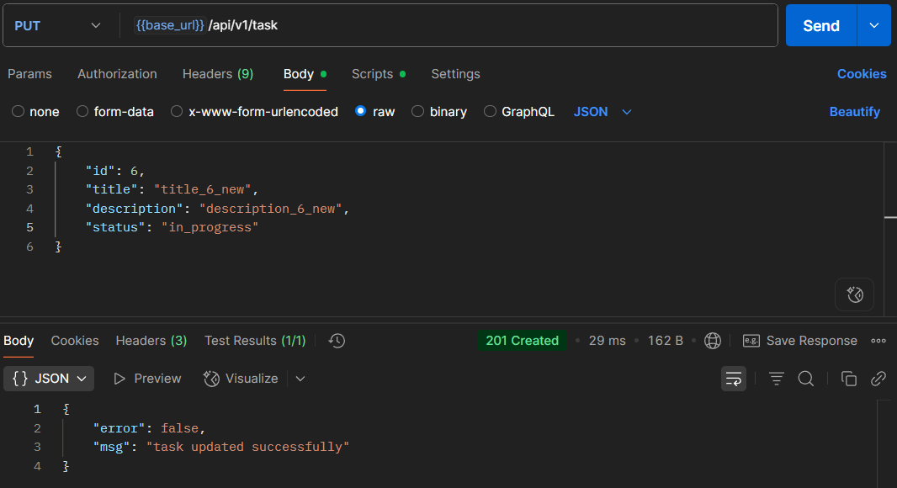
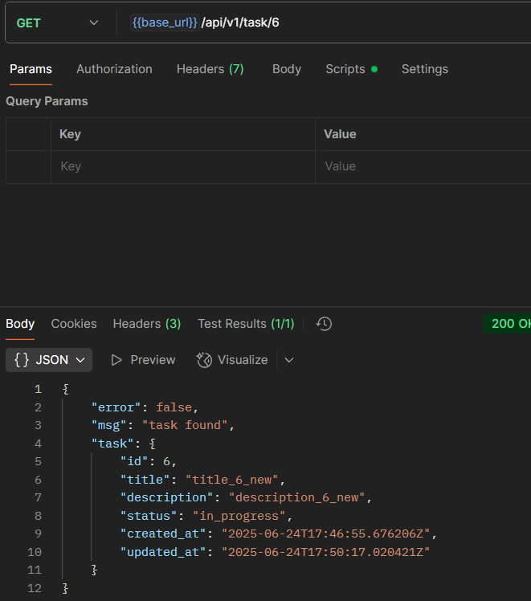
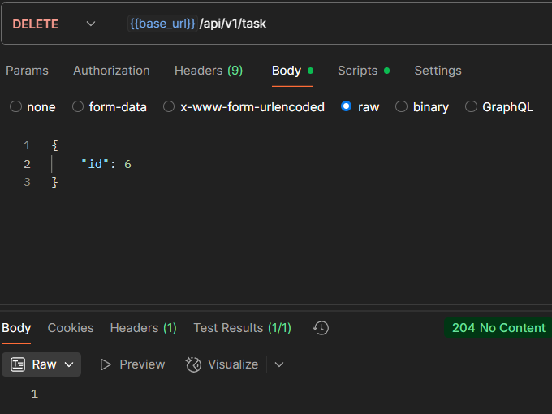
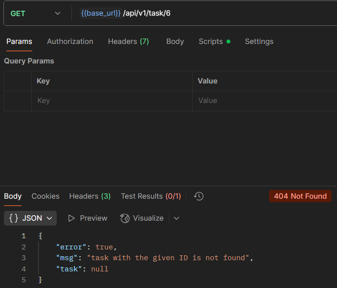
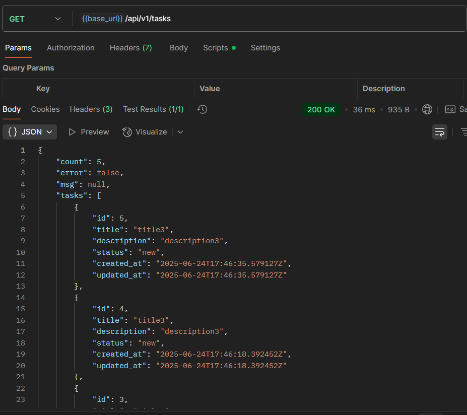

# Golang Fiber PostgreSQL(pgx)

REST API, представляющий собой приложения для создания, удаление, изменения задач. Всю информация о задачах будет хранится в PostgreSQL, также оформлена Swagger документация к проекту.

## Быстрый старт
1. Переименуйте `.env.example` в `.env` и занесите в него значения из вашей среды.
2. Установите [Docker](https://www.docker.com/get-started) и следующие полезные инструменты Go в свою систему:
    - [golang-migrate/migrate](https://github.com/golang-migrate/migrate#cli-usage) для применения миграций
    - [github.com/swaggo/swag](https://github.com/swaggo/swag) для автоматической генерации документации Swagger API
3. Запустите проект с помощью этой команды:
```bash
make docker.run

# Процесс:
#   - Создание документации по API с помощью Swagger
#   - Создание новой сети Docker для контейнеров
#   - Сборка и запуск контейнеров Docker (Fiber, PostgreSQL)
#   - Применение миграций базы данных (с помощью github.com/golang-migrate/migrate)
```
4. Перейдите на страницу документации по API: [127.0.0.1:5000/swagger/index.html](http://127.0.0.1:5000/swagger/index.html)


## 🗄 Структура проекта

### ./app

**Папка только с бизнес-логикой**.  В этом каталоге не имеет значения, какой драйвер базы данных или какие сторонние компоненты вы используете.

- `./app/controllers` папка для функциональных контроллеров (используемых в маршрутах)
- `./app/models` папка для описания бизнес-моделей проекта
- `./app/queries`  папка для описания запросов проекта

### ./docs

**Папка с документацией по API**. Этот каталог содержит файлы конфигурации для автоматически генерируемой документации по API от Swagger.

### ./pkg

**Папка с функционалом, специфичным для проекта**. Этот каталог содержит весь код, специфичный для проекта и предназначенный только для вашего бизнеса, например _configs_, _middleware_, _routes_, _utils_.

- `./pkg/configs` папка для функций настройки
- `./pkg/middleware` папка для добавления промежуточного программного обеспечения (встроенного в Fiber и вашего собственного)
- `./pkg/routes` папка для описания маршрутов проекта
- `./pkg/utils`  папка с вспомогательными функциями

### ./platform

**Папка с логикой на уровне платформы**. тот каталог содержит всю логику на уровне платформы, которая будет формировать реальный проект, например настройку базы данных или хранение миграций.

- `./platform/database` папка с функциями настройки базы данных
- `./platform/migrations` папка с файлами миграции (используется с инструментом [golang-migrate/migrate](https://github.com/golang-migrate/migrate))

## ⚙️ Конфигурация

```ini
# .env

# Stage status to start server:
#   - "dev", for start server without graceful shutdown
#   - "prod", for start server with graceful shutdown
STAGE_STATUS="dev"

# Server settings:
SERVER_HOST="0.0.0.0"
SERVER_PORT=5000
SERVER_READ_TIMEOUT=60

# Database settings:
DB_TYPE="pgx"
DB_HOST="todoapp-postgres"
DB_PORT=5432
DB_USER="postgres"
DB_PASSWORD="password"
DB_NAME="postgres"
DB_SSL_MODE="disable"
DB_MAX_CONNECTIONS=100
DB_MAX_IDLE_CONNECTIONS=10
DB_MAX_LIFETIME_CONNECTIONS=2
```

## Пример работы
## 1. Создание задачи


## 2. Изменение задачи


## 3. Получение задачи


## 4. Удаление задачи


## 5. Создание задачи


## 6. Получение всех задач
